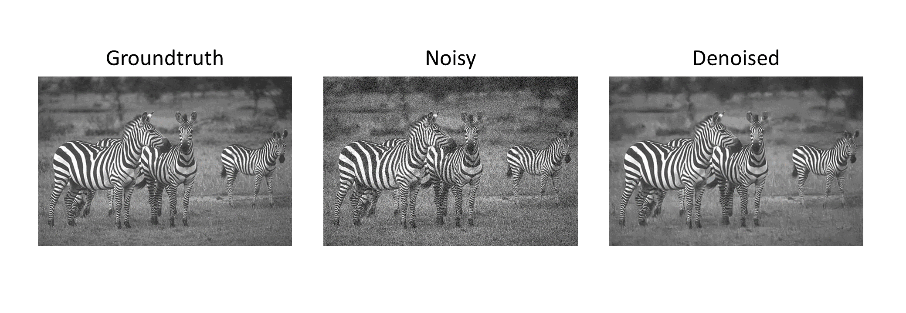

# DnCNN-tensorflow   
[](LICENSE)
[](CONTRIBUTING.md)
  
A tensorflow implement of the TIP2017 paper [Beyond a Gaussian Denoiser: Residual Learning of Deep CNN for Image Denoising](http://www4.comp.polyu.edu.hk/~cslzhang/paper/DnCNN.pdf)

## This is a fork of https://github.com/crisb-DUT/DnCNN-tensorflow
The main differences from the original version are:
- It supports RGB images.
- PIL was replaced with OpenCV.
- You don't need to generate patches in advance, which require a lot of disk and memory space.
- The noise is not added within the programme but you need an original and a noisy image, so you can train the model even with different types of noise.
- The provided checkpoint/model was trained for blind gaussian denoising with sigma values 0-50.

## Model Architecture


## Results


- BSD68 Average Result
 
The average PSNR(dB) results of different methods on the BSD68 dataset.

|  Noise Level | BM3D | WNNM  | EPLL | MLP |  CSF |TNRD  | DnCNN-S | DnCNN-B | DnCNN-tensorflow |
|:-------:|:-------:|:-------:|:-------:|:-------:|:-------:|:-------:|:-------:|:-------:|:-------:|
| 25  |  28.57  |   28.83   | 28.68  | 28.96 |  28.74 |  28.92 | **29.23** | **29.16**  | **29.17** |

- Set12 Average Result


| Noise Level | DnCNN-S | DnCNN-tensorflow |
|:-----------:|:-------:|:----------------:|
| 25          | 30.44   | **30.38**        |


## Requirements
```
tensorflow >= 1.4
numpy
opencv
```
## Dataset
I used the BDS500 dataset for training, you can download it here: http://www.eecs.berkeley.edu/Research/Projects/CS/vision/grouping/BSR/BSR_bsds500.tgz
It contains 500 RGB images, 400 for training and 100 for testing.

## Data preprocessing and noise generation
Before training, you have to rescale the images to 180x180 and adding noise to them.
The folder structure is supposed to be:
```
./data/train/original  for the 180x180 original train images
./data/train/noisy  for the 180x180 noisy train images
./data/test/original  for the 180x180 original test images
./data/test/noisy  for the 180x180 noisy test images
```
You need the original files for testing just to calculate the PSNR.
You can denoise without original files: just put the noisy files also in ./data/test/original .

## Train
```
$ python main.py
(note: You can add command line arguments according to the source code, for example
    $ python main.py --batch_size 64 )
```


## Test
```
$ python main.py --phase test
```


